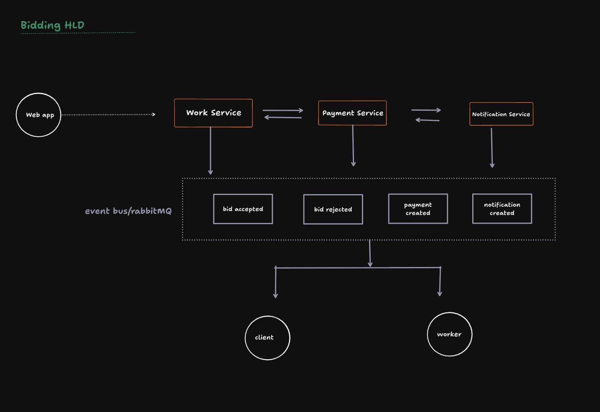

## bidding
## Overview

The bidding system allows a worker and a client to negotiate the final price of a work through the chat system.

Instead of creating separate REST APIs for bidding, the entire feature is implemented using Socket.IO because every action must be reflected instantly to both users.

Every bid action is stored as a system message so the existing chat infrastructure can render the complete bidding history without additional APIs.

# Components

## BidService (Frontend)

Responsible for sending bidding events to the backend.

Main methods:

- sendWorkerOffer()
- sendClientCounterOffer()
- respondToBid()
- notifyPaymentCompleted()

## SocketManager

Receives socket events and forwards them to the correct use case.

Handles events such as:

- send_bid_offer
- respond_bid
- bid_payment_completed

## SendBidOfferUseCase

Responsible for:

- Creating the first bid
- Creating a counter offer
- Validating whose turn it is
- Allowing only one counter offer
- Saving bid history
- Broadcasting new bid messages

## RespondToBidUseCase

Responsible for:

- Accepting a bid
- Rejecting a bid
- Updating bid status
- Broadcasting the result

# Database

Two collections are used.

## Bid Collection

Stores the current negotiation state.

Example:

status
currentAmount
awaitingResponseFrom
history
workId

## Message Collection

Stores bid events as system messages.

Examples:

- WORK_BID_OFFER
- WORK_BID_COUNTER
- WORK_BID_ACCEPTED
- WORK_BID_REJECTED
- WORK_BID_PAID

The chat screen renders these messages as bid cards.

Worker can

- Accept
- Reject

(No second counter offer is allowed.)

## 4. Payment

After acceptance

# Business Rules

- Only one active bid per work.
- Worker always starts the negotiation.
- Only one counter offer is allowed.
- Turn order is enforced on the server.
- Accepted and rejected bids cannot be modified.
- Client is always responsible for payment.
- Every bid action creates exactly one system message.
